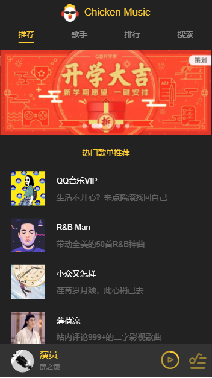
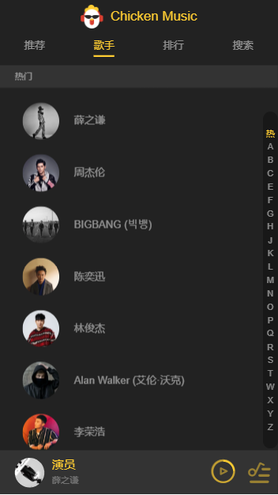
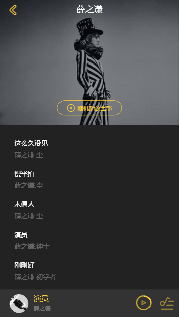
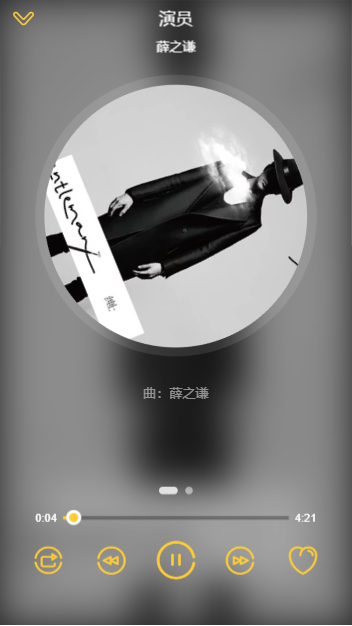
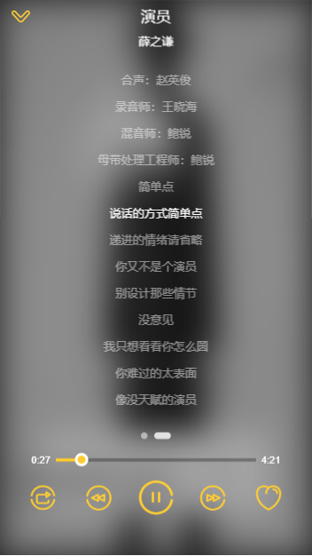

# Vue2.5 开发去哪儿网App
简述：仿移动端QQ音乐，使用 axios, jsonp等方法抓取QQ音乐的真实数据，使用组件化思想打造的一款接近原生音乐App体验的音乐App。

<!-- # [项目预览](https://wanggege919.github.io/travel-new/dist/index.html#/) -->

# 技能树
- 使用语言：vue + vue-cli + axios + vuex + vue-router + stylus + eslint + es6
- 使用 vue-cli 进行原型开发并配置 config
- 使用 vue-router 进行路由管理，与vueJs集成构建单页应用，分模块化配置
- 使用 vuex 进行地址状态管理，支持增删改查
- 使用 axios + promise 异步请求
- 使用 组件化开发，整个项目由页面的基本组件，公用组件完成
- 使用 swiper + better-scroll + animate.css 插件
- 使用 stylus 语法：嵌套，混入，函数等

# 图示

  
  
  
  
  

